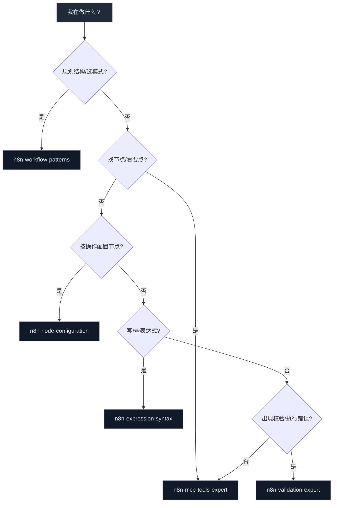
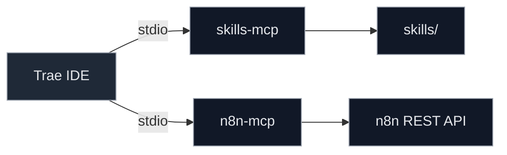

# 项目规则（Trae + MCP + n8n）

## 目标
- 在 Trae 中启用 `skills-mcp` 与 `n8n-mcp`，通过技能与工具协作构建与管理 n8n 工作流。
- 统一交互与验证规范，提升稳定性与可观测性。

## MCP 服务
- 技能服务配置：`config/trae-skills-mcp.json`（路径必须为绝对路径，例如 `E:/User/Documents/GitHub/n8n-workwolf/skills`）
- n8n 服务配置：`config/trae-mcp-n8n.json`（已启用 `N8N_API_URL` 与 `N8N_API_KEY`）
- 启动脚本：
  - `scripts/run-skills-mcp.ps1`
  - `scripts/run-n8n-mcp.ps1`

## 技能调用
- 技能目录：`skills/`；示例技能：`skills/n8n-mcp-tools-expert/SKILL.md`
- 调用方式：在 Trae 中通过自然语言触发（如“查找触发节点”“校验 HTTP Request 配置”）；也可在 MCP 面板使用“列出技能”“查看技能说明”。

### 技能清单与触发时机（必须遵循）
- `n8n-mcp-tools-expert`：当需要发现节点、获取节点要点、校验配置、创建/增量更新/验证工作流、查找模板、查看工具文档时使用。优先级最高的入口技能。
- `n8n-node-configuration`：当需要按资源/操作精确配置节点、理解字段显示依赖（displayOptions）、判定必填项、选择正确操作模式时使用。
- `n8n-validation-expert`：当出现校验报错/警告/类型不匹配/表达式错误/连接问题，或需要选择校验 Profile、走“验证-修复-再验证”闭环时使用。
- `n8n-workflow-patterns`：当需要规划架构、选择模式（Webhook/HTTP集成/数据库/AI/Schedule）、设计数据流与错误处理、执行创建清单时使用。
- `n8n-expression-syntax`：当需要编写/排查表达式（`{{ }}` 语法、`$json/$node/$now/$env`）、尤其是 Webhook 数据位于 `$json.body` 的场景时使用。

### 智能体调用约定（必须遵循）
- n8n 聚鑫流控（id: `n8n-juxin-workflow`）
  - 用途：编写/修改/复制 n8n 工作流；最小化增量更新；切换凭据；端到端测试。
  - 触发场景：
    - “创建/复制/修改 聚鑫 工作流”
    - “切换到凭据鉴权/批量移除内联 Authorization”
    - “修复节点表达式/IF 条件/连接结构”
  - 产出：更新操作清单或直接应用的增量变更 + 运行期校验结果 + 测试建议。
- 聚鑫对齐校验（id: `juxin-api-alignment-auditor`）
  - 用途：严格对齐知识库文档进行一致性审计；生成差异与修复建议（不直接更改）。
  - 触发场景：
    - “上线前合规校验/发布前走查”
    - “接口返回异常/怀疑参数名或端点不一致”
  - 产出：pass/warn/fail 结论、节点级问题清单、可执行的 `n8n_update_partial_workflow` 修复建议数组。

## 变更铁律（强制执行）
- 修改工作流时，必须使用 MCP 工具先获取目标工作流“完整信息”，做到“看全 → 再改”。流程：
  1) 获取工作流：获取 id/name/active/nodes/connections 全量信息（包含各节点 parameters）
  2) 最小化增量更新：仅对必要节点用 `n8n_update_partial_workflow`，避免覆盖无关参数
  3) 结构与表达式校验：`n8n_validate_workflow`（validateNodes/Connections/Expressions，profile:"runtime"）
  4) 端到端测试：按触发入口执行一次完整流程（含轮询与成功/失败分支），确认与文档一致
- 上述四步缺一不可；禁止跳过“获取完整信息”和“完整测试”。

- 单一功能最小增量：一次改动只做一个功能模块的最小变更；如需覆盖多分支，仅限同一功能的“镜像改动”，并且必须先在一个分支验证通过，再同步到其他分支。
- 核心业务保护：不得为“通过校验”或“样式升级”而改动核心业务结构（例如轮询闭环、触发链路、鉴权流）；新增功能只能在成功分支末尾串接，严禁影响既有模块的运行逻辑。
- 分支独立验证：同一功能存在多分支（如 Text/Image）时，两个分支都要分别验证且互不干扰；任何一支的失败不得阻断另一支的正常执行。

### 约束规则：参数覆盖保护（强制）
- 切换鉴权或调整请求头时，只能更新以下字段：`parameters.authentication`、`parameters.genericAuthType`、`parameters.headerParameters`、`credentials`；严禁连带改动 `parameters.url/method/sendBody/contentType/bodyParameters` 等关键字段。
- 增量更新不得传入无关空对象/空数组，以免触发默认值回填（例如把 `method` 重置为 `GET`、`url` 回填为 `http://example.com/index.html`）。除非确需修改，否则不要在更新中包含该字段。
- 提交更新前先读取并比对节点完整参数；提交后立即单步执行验证：URL/Method/Body 未变化，鉴权生效。
- IF/Switch 节点必须包含 `conditions.options={version:2,leftValue:"",caseSensitive:true,typeValidation:"strict"}`；布尔/一元操作符需带 `singleValue:true`；缺失将导致校验失败。

## 工具使用规范
- 发现节点：优先 `get_node_essentials`，必要时再用 `get_node_info`；按类别使用 `list_nodes`；全文检索用 `search_nodes`（参考 `n8n-mcp-tools-expert`）。
- 校验配置：缺失项用 `validate_node_minimal`；运行期验证用 `validate_node_operation`（`profile:"runtime"`）。
- 管理工作流：创建用 `n8n_create_workflow`（节点需含 `parameters` 且连接完整）；增量更新用 `n8n_update_partial_workflow`；整体验证用 `n8n_validate_workflow`。
- 版本与容错：尽量使用最新 `typeVersion`；关键节点添加错误处理与重试；开启响应头/状态返回便于排错。这些属于“质量类改动”，必须在独立迭代中执行，不得与业务功能改动同批次进行，且不得改变核心逻辑。

### 聚鑫 API 调用规范（强制）
- 仅以知识库中的"聚鑫 API 全量文档""聚鑫 API 全量2"为权威依据，严格按文档的方法、路径、参数名/类型与返回结构执行，禁止自由发挥。
- 端点、HTTP 方法、请求头、请求体键名及取值、查询参数与轮询查询路径，均须与文档逐条对齐；若存在多版本风格，需在节点备注中标注所选风格并保持一致。
- 字段映射（如 orientation/size/prompt/images 等）必须来自表单或上游节点，禁止硬编码与文档冲突的默认值。
- 鉴权信息不得写入仓库文件；仅在本地 n8n 凭据或环境变量中配置。
- **VEO API 鉴权方式**：聚鑫 VEO 接口（/v1/videos）使用 **Bearer Auth**（非 Header Auth）。HTTP Request 节点配置：
  - `authentication: "genericCredentialType"`
  - `genericAuthType: "httpBearerAuth"`
  - 凭据类型：`httpBearerAuth`（Header Auth 仅用于 Sora-2 接口）

### nodeType 前缀规范（强制）
- 搜索/校验类工具使用短前缀：`nodes-base.httpRequest`、`nodes-base.webhook`。
- 工作流操作类工具使用全前缀：`n8n-nodes-base.httpRequest`、`n8n-nodes-base.webhook`。
- 如需两者互转，优先通过 `search_nodes` 结果中的 `nodeType/workflowNodeType` 字段。

### 校验 Profile 与自动清理（强制）
- Profile 选择：开发快速用 `minimal`，预发布与回归用 `runtime`（推荐），AI 生成配置可用 `ai-friendly`，生产基线可用 `strict`。
- 增量更新会触发自动“结构净化”（operators 的 `singleValue`、IF/Switch 元数据修复）；连接错误、分支数量不匹配不会被自动修复。
- 合法轮询闭环豁免：当校验报告因“合法的轮询闭环（Wait→Check→Normalize→IF→回 Wait）”产生的 `cycle` 错误时，按“业务预期结构”记录并采用说明性豁免或在测试环境降级 Profile 验证；不得为了通过校验而拆改轮询回路。

### 配置工作流（落地步骤）
1. 选模式与结构：`n8n-workflow-patterns` 清单驱动。
2. 找节点与要点：`search_nodes` → `get_node_essentials`（必要时 `get_node_info`）。
3. 按操作配置：`n8n-node-configuration` 指南；复杂依赖看 `get_property_dependencies`。
4. 写表达式：`n8n-expression-syntax`；Webhook 数据一律从 `$json.body` 读取。
5. 节点校验：`validate_node_operation`（`profile:"runtime"`）。
6. 创建/更新：`n8n_create_workflow` 或 `n8n_update_partial_workflow`（使用语义分支参数 `branch/case`）。
7. 工作流校验：`n8n_validate_workflow`（节点/连接/表达式）。
8. 模板参考：`search_templates`/`get_template` 辅助对齐最佳实践。
9. 激活与测试：在 n8n UI 手动激活；区分 Test/Production Webhook URL；首批执行需监控与记录。

## 代理与安全
- Windows 代理（Clash 本机 7890）：可在 PowerShell 设置 `HTTP_PROXY`、`HTTPS_PROXY`；必要时为 npm 设置代理。
- 不在仓库中明文提交密钥；尽量本地注入或使用环境变量。
- 不直接在生产工作流上应用 AI 修改；优先复制与在开发环境验证。

## 交互流程

## 技能用例与预期（统一验证基线）
- “按操作配置 HTTP POST” → 返回必填 `sendBody/body.content` 结构与依赖；`runtime` 校验通过（`n8n-node-configuration`）。
- “表达式报错：Cannot read property of undefined” → 指出缺少父级路径并给出 `$json.body.xxx` 修正（`n8n-expression-syntax`）。
- “列出触发节点” → 返回触发类集合（数量>0）（`n8n-mcp-tools-expert`）。
- “快速校验 HTTP GET” → 缺失 `url` 时提示缺失；提供后通过（`validate_node_operation`）。
- “运行期校验 HTTP GET” → 无操作级错误；可能给出改进建议（`profile:"runtime"`）。
- “创建最小工作流” → 返回新工作流 `id`，结构校验通过（`n8n_create_workflow` + `n8n_validate_workflow`）。
- “升级节点版本到 4.3” → 更新成功，校验无错误，仅建议补充错误处理（`n8n_update_partial_workflow`）。
- “开启响应头与状态” → 在 `options` 中启用，验证通过（`validate_node_operation`）。
- “添加重试与超时” → 配置后运行期校验通过，建议合理 `maxTries/timeout`（`n8n-validation-expert` 建议）。
- “清理异常连接” → 执行 `cleanStaleConnections`，再次校验无连接错误（`n8n_update_partial_workflow`）。

## 10 条用例与预期
- “列出触发节点” → 返回触发类集合（数量>0）。
- “获取 HTTP Request 要点” → 返回必填 `url` 与常用属性。
- “快速校验 HTTP GET” → 缺失 `url` 时提示缺失；提供后通过。
- “运行期校验 HTTP GET” → 无操作级错误；可能给出改进建议。
- “创建最小工作流” → 返回新工作流 `id`，结构校验通过。
- “升级节点版本到 4.3” → 更新成功，校验无错误，仅建议补充错误处理。
- “开启响应头与状态” → 建议在 `options` 配置中开启，验证通过。
- “添加重试与超时” → 配置后运行期校验通过，建议合理 `maxTries` 与 `timeout`。
- “查询执行历史” → 返回空/列表；新建未执行则为空。
- “获取执行详情预览” → 返回结构与节点计数；根据推荐选择 `summary/filtered`。

## 常见问题
- 绝对路径错误：确保使用 `E:/...` 或转义 `E:\...`。
- 无触发可外部调用：需添加 `Webhook` 并激活；否则仅编辑器执行。
- 本机触发报 SSRF：改用外部可达地址或在本地环境外部浏览器触发。

## 强制规则（All n8n 操作与规划必须符合）
- 技能调用遵循“技能清单与触发时机”与“配置工作流（落地步骤）”。
- 任何节点/工作流变更必须通过相应校验工具，默认 `profile:"runtime"`。
- 使用正确的 nodeType 前缀；严禁混用短前缀与全前缀。
- 表达式一律用 `{{ }}` 包裹，Webhook 输入从 `$json.body` 读取；禁止在 Code 节点中使用表达式语法。
- 增量构建与迭代；每次重要变更后执行工作流校验与最小化集成测试。
- 聚鑫 API 的所有调用与字段映射必须严格依知识库文档执行（“聚鑫 API 全量文档”“聚鑫 API 全量2”），禁止臆测或擅自变更字段。
- 修改工作流的任何操作必须先通过 MCP 获取完整工作流信息，并按“最小化增量更新 + 结构/表达式校验 + 端到端测试”闭环执行。